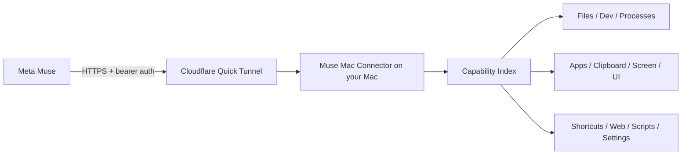

# Muse Mac Connector

> **Give Meta Muse hands on your Mac — while keeping the Mac owner in control.**

[](#status)
[](#requirements)
[](LICENSE)

Muse Mac Connector is a free, open-source macOS menu-bar app that gives Meta Muse a secure, authenticated set of tools for working on your Mac.

**Unofficial community project. Not affiliated with or endorsed by Meta.**

## The simple version

1. Download **Muse Mac Connector** from GitHub Releases.
2. Open the app. A small circle appears in the Mac menu bar.
3. Wait for **Ready**. The app creates a free Cloudflare Quick Tunnel and copies the current Muse setup automatically.
4. Open Muse and press **Command-V**.
5. If Muse asks for the access key through its secure credential flow, use **Copy Muse Access Key** from the menu-bar app.

If the Mac restarts or the free tunnel changes, open the app again. It reconnects and copies the new setup automatically. **Open → paste → continue.**

## Status

**v0.5.0 alpha — Computer Operator edition.**

v0.5 adds a machine-readable capability index and an optional **Full Computer Mode** so Muse can combine small Mac actions into larger multi-step jobs instead of relying on one hard-coded workflow per task.

The downloadable build is currently ad-hoc signed, not Apple Developer ID signed/notarized. macOS may show an extra Gatekeeper warning. If that happens, use Finder's **Open** command or the **Open Anyway** option in Privacy & Security after verifying you downloaded it from this repository.

## What v0.5 can do

When enabled, the capability index exposes 11 capability packs, 25 operational actions, plus the consent-gated `access.enable_full` authority action:

- **Files:** Restricted Mode uses configured roots; Full Computer Mode can list, read, write, create, move, copy, and trash files anywhere the logged-in account can access.
- **Developer commands:** Restricted Mode uses guarded single-command execution; Full Computer Mode supports general Terminal-style command strings through the user shell, including normal chaining, pipes, and redirection.
- **Processes:** start, inspect, read output from, and stop long-running processes.
- **Apps:** launch installed macOS applications.
- **Clipboard:** read and write the clipboard.
- **Screen:** capture the display for visual inspection.
- **UI:** inspect the frontmost app, activate apps, click, type, and press keys/hotkeys.
- **Shortcuts:** run Apple Shortcuts by name.
- **Web:** open HTTP(S) URLs.
- **Scripts:** run executable scripts intentionally placed in the connector scripts folder.
- **Settings:** change explicitly requested macOS defaults string values.

Muse discovers the machine-readable version at `GET /capabilities`, including parameter schemas, enabled state, confirmation requirements, actual filesystem/command authority, and behavior policy.

## Full Computer Mode

The connector starts conservatively. To expose the complete capability index:

1. Click the menu-bar circle.
2. Choose **Enable Full Computer Mode**.
3. Read the explanation and approve it.

Full Computer Mode removes the connector's configured-folder and conservative-command fences. Muse can work anywhere the logged-in Mac account can access and can run general Terminal-style command workflows. It does **not** bypass macOS privacy or privilege controls: Accessibility, Screen Recording, Automation, Full Disk Access, admin/password prompts, TCC, and SIP still apply. Obvious destructive, privileged, and credential-sensitive operations keep a local approval gate.

Muse can also request `access.enable_full` itself. Your Mac shows the approval dialog, and approval updates the running helper immediately — no config edit or restart. You can inspect the real live authority at any time with **Capability Index**. See [FULL_COMPUTER_MODE.md](FULL_COMPUTER_MODE.md) for the non-negotiable product contract and release benchmark.

## Menu-bar controls

- **How to Use — Easy Steps** — the plain-language setup instructions.
- **Capability Index** — shows the current capability packs and enabled state.
- **Enable Full Computer Mode** — explicit opt-in to all capability packs.
- **Connect to Muse** — opens Muse and copies the current setup when ready.
- **Reconnect & Copy Setup** — creates a fresh Quick Tunnel and copies the replacement setup.
- **Copy Connection Setup** — copies the current Muse setup.
- **Copy Muse Access Key** — copies the Keychain-backed access key temporarily.
- **Permissions & Capabilities** — opens the relevant macOS permission settings.
- **Advanced Setup** — opens config, scripts, and connector data locations.
- **Pause Agent** — blocks new requested actions without quitting the app.
- **Stop Connector / Quit Connector** — stops the local services cleanly.

Opening the already-running `.app` again is intentionally useful: it refreshes the Quick Tunnel and copies the new connection setup.

## How it works



The AI runs in the cloud. The actual computer actions run on your Mac. The free edition uses an outbound Cloudflare Quick Tunnel, so you do not need to buy a domain, configure DNS, or expose a router port.

## Security model

- Local API binds to `127.0.0.1:8899`.
- Remote access uses an outbound HTTPS Cloudflare tunnel.
- Every request requires a randomly generated 256-bit bearer key.
- The key is stored in the current user's macOS Keychain when available.
- Restricted Mode bounds file operations to configured roots and uses conservative command parsing.
- Full Computer Mode is explicit opt-in and removes those connector authority fences.
- Full Mode general commands can chain normal shell operations; obvious destructive, privileged, and credential-sensitive commands require local confirmation.
- macOS Accessibility, Screen Recording, Automation, Full Disk Access, admin/password prompts, TCC, and SIP remain under macOS control.
- **Pause Agent** immediately blocks new requests.
- No analytics, telemetry, folder watching, or project-owned backend.

See [SECURITY.md](SECURITY.md) and [PRIVACY.md](PRIVACY.md). This is an alpha and has not undergone an independent security audit.

## Requirements

For the downloadable app: macOS.

For source builds: macOS, Python 3, Homebrew, and `cloudflared`.

## Build from source

```bash
git clone https://github.com/dkm90x/muse-mac-connector.git
cd muse-mac-connector
./install.sh
./build-app.sh
```

The standalone app is created at:

```text
dist/Muse Mac Connector.app
```

The build bundles its Python runtime/dependencies and `cloudflared`, so users do not need to run a startup command.

## Run from source

```bash
./install.sh
./start-secure.sh
```

Useful local commands:

```bash
muse-mac capabilities
muse-mac doctor
muse-mac enable all
```

## Configuration

Choose **Advanced Setup → Open Config File** to edit:

```text
~/Library/Application Support/Muse Mac Connector/config.yaml
```

Configuration controls working roots, enabled capabilities, and confirmation requirements. Restart the connector after manual config changes.

## Project structure

```text
connector/      menu-bar app, tunnel/process supervision, Keychain integration
mac_agent/      authenticated HTTP API, capability registry, guarded Mac actions
tests/          operator, security, and public-hygiene tests
build-app.sh    standalone .app build pipeline
release-macos.sh Developer ID/notarization pipeline for a future signed release
```

## Free edition and future hosted option

The MIT free edition stays self-managed and uses free Cloudflare Quick Tunnels. A future hosted option may provide a stable endpoint and managed relay infrastructure; it would charge for convenience/infrastructure, not for access to the source or basic security controls.

## License

Released under the **MIT License**. See [LICENSE](LICENSE).

Built by **Jordan (@dkm90x)**. Contributions, testing, issue reports, and security-minded review are welcome.
