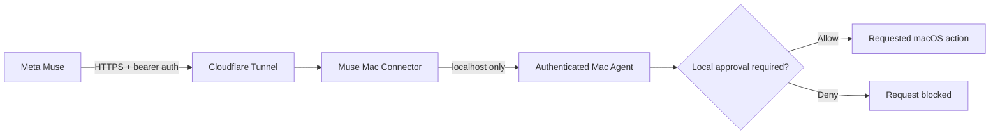

# Muse Mac Connector

> **Give Meta Muse hands on your Mac — without giving it unchecked access.**

[](#status)
[](#requirements)
[](LICENSE)
[](SECURITY.md)

Muse Mac Connector is an open-source macOS menu-bar app that lets **Meta Muse request user-approved actions on your own Mac** through an authenticated local capability service and an outbound Cloudflare tunnel.

It is intentionally built around a simple rule:

**The AI can request. The Mac owner decides.**

> **Unofficial community project.** Not affiliated with, endorsed by, or maintained by Meta.

## Why I built it

Meta Muse can reason in the cloud, but I wanted it to safely act on my actual computer — move a file, run a Shortcut, open something, or trigger a script — without handing an AI unrestricted control of the machine.
Instead of building a remote-control backdoor, I built a **capability broker**:



The connector exposes only configured capabilities, stores its access key locally, and requires on-device confirmation for every default action.

## What it demonstrates

This project is also a practical exploration of agent infrastructure and human-in-the-loop security:

- Designing a narrow capability layer instead of unrestricted computer access.
- Secure local secret storage with macOS Keychain.
- Authenticated HTTP APIs and timing-safe credential comparison.
- Filesystem sandboxing with configurable allowed roots.
- Local approval gates for AI-requested actions.
- Process supervision and automatic recovery for local services and tunnels.
- Packaging Python services into a clickable macOS menu-bar application.
- Building the product so paths, accounts, credentials, and configuration belong to **the person who installs it**, not the developer.
## Status

**v0.4.3 alpha — working free/DIY edition.**

The current free edition uses a Cloudflare Quick Tunnel. Quick Tunnel addresses can change after a restart, so the connector always exposes the current connection details and can restart a failed tunnel automatically.

The app now supports a true Finder-style launch: open **Muse Mac Connector.app** and it starts the menu-bar UI, bundled Mac agent helper, and bundled `cloudflared` process automatically.

The connector also publishes a behavior contract through `/capabilities`: when the user says to use the Mac, the AI should use the connector directly, avoid Terminal-install workarounds, and clearly report any missing capability instead of inventing one.

### Distribution note

The code and local build are ready for public use, but downloadable release artifacts are **not yet Developer ID signed or notarized by Apple**. That does not affect the MIT source release, but macOS may show additional Gatekeeper friction for an unsigned download.

The project is currently self-funded. If it begins generating revenue or voluntary support, the first distribution milestone is to use that money for the Apple Developer Program so releases can be Developer ID signed and notarized.

## Security-first defaults

- Local API binds only to `127.0.0.1:8899`.
- Remote access uses an outbound HTTPS Cloudflare tunnel.
- Every API request requires a randomly generated 256-bit bearer key.
- The key is stored in the current Mac user's Keychain when available.
- Every default Mac action requires an on-device confirmation.
- File actions are limited to Downloads, Desktop, and Documents by default.
- **Pause Agent** immediately blocks new action requests.
- Request bodies are size-limited and results are held only in bounded memory.
- No analytics, telemetry, folder watching, project-owned backend, or background uploading.
## Current capabilities

Muse can request the following actions when they are enabled in configuration:

- Run an Apple Shortcut.
- Move or copy files inside configured folders.
- Change a macOS `defaults` string value.
- Open an HTTP(S) URL.
- Run an executable script deliberately placed in the connector's scripts folder.

Nothing points at the original developer's files or accounts. Paths beginning with `~` resolve to the Mac user who installed the connector.

## Menu-bar controls

- **Connect to Muse** — opens Muse and copies the current connection setup.
- **Copy Muse Access Key** — copies the Keychain-backed key for 60 seconds.
- **Permissions & Capabilities** — explains optional macOS permissions and links to System Settings.
- **Advanced Setup** — opens the per-user config, scripts folder, or connector data folder.
- **Restart Tunnel** — creates a fresh Quick Tunnel.
- **Pause Agent** — blocks new action requests without closing the app.
- **Stop Connector** — stops the local agent and tunnel.
- **Quit Connector** — cleanly shuts down the full process tree.

The app supervises its helper services and requires a real `/health` response before treating the local agent as healthy.
## Requirements

For the source/build workflow:

- macOS
- Python 3
- Homebrew
- `cloudflared`

## Build the clickable Mac app

```bash
git clone https://github.com/dkm90x/muse-mac-connector.git
cd muse-mac-connector
./install.sh
./build-app.sh
```

The application is created at:

```text
dist/Muse Mac Connector.app
```

The build bundles its Python runtime/dependencies and `cloudflared`, so the resulting app launches by clicking the icon rather than requiring a startup command.

Local builds are ad-hoc signed. `release-macos.sh` contains the Developer ID signing, DMG, notarization, stapling, and Gatekeeper verification pipeline for a future signed release.
## Run from source

```bash
./install.sh
./start-secure.sh
```

Source mode remains available for development, auditing, and users who prefer not to run a packaged build.

## Connect Muse

1. Launch **Muse Mac Connector**.
2. Click the menu-bar circle and choose **Connect to Muse**.
3. Paste the copied setup message into Muse.
4. If Muse requests the credential through its secure credentials UI, choose **Copy Muse Access Key**.
5. Approve or deny requested Mac actions locally.

Never paste the access key into ordinary chat, a GitHub issue, a log, or source code.

## Configuration

Choose **Advanced Setup → Open Config File** to create/open:

```text
~/Library/Application Support/Muse Mac Connector/config.yaml
```

Configuration controls allowed filesystem roots, enabled actions, and which actions require local confirmation. Changes apply after restarting the connector.
## Project structure

```text
connector/      menu-bar app, process supervision, Keychain integration
mac_agent/      authenticated localhost API and guarded Mac actions
tests/          security and public-hygiene tests
build-app.sh    standalone .app build pipeline
release-macos.sh future Developer ID + notarized DMG release pipeline
```

## Roadmap

The free MIT edition will remain usable as a self-managed connector.

Near-term priorities:

- Publish and harden the free alpha with real-world feedback.
- Improve first-run onboarding and diagnostics.
- Add signed/notarized distribution when project revenue can cover the Apple Developer Program.
- Explore an optional managed edition with a stable hostname and zero tunnel maintenance while keeping the local security model intact.

A paid service, if built, would monetize **convenience and managed infrastructure**, not basic security controls or access to the source.

## About the developer

Built by **Jordan (@dkm90x)** as an independent project at the intersection of AI agents, automation, product design, and human-in-the-loop security.

The project started from a practical question: *what is the smallest secure layer needed to let a cloud AI do useful work on a personal computer while leaving the human in control?*
## Security and privacy

Before widening access, read:

- [SECURITY.md](SECURITY.md)
- [PRIVACY.md](PRIVACY.md)

This is an alpha developer preview and has not undergone an independent security audit.

## License

Released under the **MIT License**. See [LICENSE](LICENSE).

Contributions, testing, issue reports, and security-minded review are welcome.
